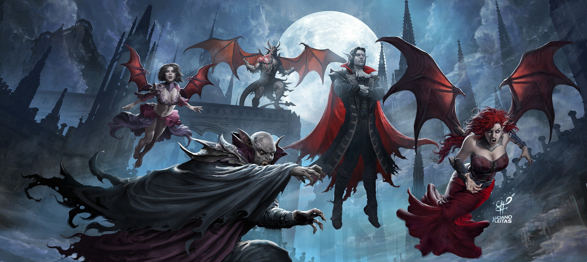

# Маскарад вампиров

Игровой режим, рассказывающий историю о тайных кланах вампиров, сражающиеся за влияние над городом, который является лишь "людской фермой" с их точки зрения.

## Фракции
В режиме обязательно участвует фракция "Империя", а так же 2-3 небольших фракций "Клан вампиров". 

### Цель "Империи": 

- Случайная стандартная цель империи.
- Скрытая цель, появляющаяся если поселение узнает о вампирах:
	- Уничтожить все кланы вампиров, став свободным городом.

### Цель "Вампирских кланов":

- Уничтожить другие вампирские кланы
- Сохранить больше Х% поселения в живых